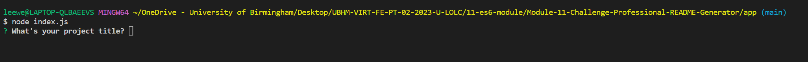
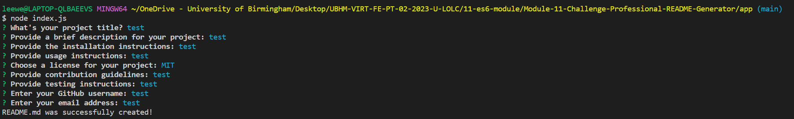
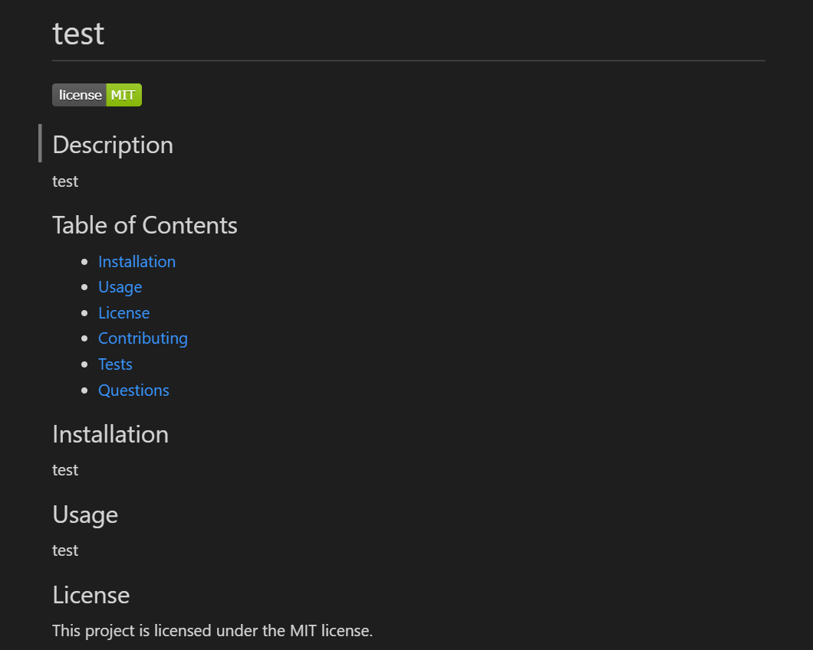

# Module-11-Challenge-Professional-README-Generator

# Professional README Generator

## Description

I was tasked with creating a Professional README Generator. I elected to write this README by hand. I understand that for any open source project on GitHub it is important to have a high-quality README for the project.

The README should follow more or less the same format as what I've been doing here for this Course, however with the added extras of having a contents page, questions section, contributions section and a dedicated License badge.

This generator works in the commandline, therefore allowing for quick and easy README generation

## Installation
Please visit this URL for a Walkthrough Guide of the Application: https://drive.google.com/uc?id=1Ly68cxhz9nBlDKuvzkT43Zw7wUAbdZqL&export=download

## Usage

The Challenge is comprised of a few interesting components; the main driver is the index.js file which is run with Node. The second part takes these files and generates the file using Markdown, the language of the README's on GitHub which allows for special styling.

Firstly, the user will need to install the necessary dependencies for Inquirer - please note I am using version 8.0.0 for this:

![Inquirer]
In the Integrated Terminal on the root level run:

```bash
npm install --save inquirer@^8.0.0
```

Once the Inquirer module has been installed, go to Index.js in the Integrated Terminal and run:

```bash
node index.js
```

This will start the Questions for the user where they can enter their Project details, starting with the Title.



Once all the questions have been filled in, a message will appear to confirm whether a README file was successfully created or not:



The new file will appear in the App Folder of the project:



When you run the generator again, the new file will overwrite the old one unless you moved it somewhere safe.

## Credits

Usual credits to the teaching staff and support we've recieved over the last few weeks.

The University of Birmingham provided the materials and guides I used to get this started: https://www.birmingham.ac.uk/index.aspx

To the incredible people who contribute to Stack Overflow: https://stackoverflow.com/

The creators of the MDN: https://developer.mozilla.org/en-US/

W3 Schools: https://www.w3schools.com/

License
There is no license specified for this project.
